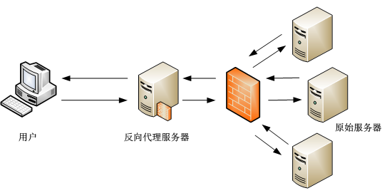

# 7.1 Apache服务器

## 简介

Apache是世界使用排名第一的Web服务器软件。它可以运行在几乎所有广泛使用的计算机平台上，由于其跨平台和安全性被广泛使用，是最流行的Web服务器端软件之一。它快速、可靠并且可通过简单的API扩充，将Perl/Python等解释器编译到服务器中。

## 安装

Linux 平台apache安装非常简单，各个发行版均打包了相应的apache可以直接安装。例如，ubuntu 以下可以直接使用apt进行安装：

> sudo apt install apache2

如果没有对应的打包的版本，也可以在官网[下载源码包](http://www.apache.org/dist/httpd/)编译安装。

``` bash
cd ~/httpd
chmod 740 ./configure
./configure
make
sudo make install 
```

**php 站点**

- 如果需要运行一个php站点，则还需要安装以下的包：

    > sudo apt install php7.2-common libapache2-mod-php7.2 php7.2-cli

- 虚拟主机的`index`属性中增加`index.php`

[参考文档](https://www.php.net/manual/zh/install.unix.debian.php)

## 第一个http服务

通过apt安装的apache在安装完成后运行：

> sudo service apache2 start

启动apache服务器，然后，在浏览器内输入[http://127.0.0.1](http://127.0.0.1)即可访问到网页。


## 配置文件

第一个页面会展示apache当前系统下配置文件的位置：

```
/etc/apache2/
|-- apache2.conf
|       `--  ports.conf
|-- mods-enabled
|       |-- *.load
|       `-- *.conf
|-- conf-enabled
|       `-- *.conf
|-- sites-enabled
|       `-- *.conf
```

- apache将配置分散到各个不同的配置文件中，其中apache2.conf是主配置文件，将各个文件汇总在一起，常规建站请不要修改该配置文件。

- ports.conf总是被包括在主配置文件中，用于决定监听的端口。

- 在`mods-enabled/`, `conf-enabled/` 和 `sites-enabled/` 目录中的配置文件包含了已经启用的管理模块(module)、全局配置片段(conf)、虚拟主机（sites）等配置。

    这些配置文件使用软链接创建来自 *-available中的配置文件，模块(mods)、站点(sites)、配置文件(conf)的启用和禁用可以分别使用命令`a2enmod`、`a2dismod`、`a2ensite`、`a2dissite`、`a2enconf`、`a2disconf`命令创建软链接。

- apache的二进制可执行文件是apache2，位置在`/usr/bin/apache2`，由于默认配置中使用了系统环境变量，apache2的启动和停止需要启动或停止 `/etc/init.d/apache2` 或 `apache2ctl`，直接调用`/usr/bin/apache2` 不会启用默认的配置文件。

**注意：**
- 更改任何一个配置文件后需要重新启动apache服务以使其生效：

    > sudo service apache2 restart

- 推荐在修改任何配置文件前先将原配置备份：
    
    > sudo cp *.conf *.conf.bak

## 站点目录

默认情况下，ubuntu不允许web浏览器获得`/var/www`、公共html目录（如果已经启用）、`/usr/share`（web应用）以外的任何文件的权限。如果你需要使用任何其他位置作为站点的根目录，你需要在`/etc/apache2/apache2.conf`中将其加入白名单。

配置文件默认的许可目录如下：

```apache
# Sets the default security model of the Apache2 HTTPD server. It does
# not allow access to the root filesystem outside of /usr/share and /var/www.
# The former is used by web applications packaged in Debian,
# the latter may be used for local directories served by the web server. If
# your system is serving content from a sub-directory in /srv you must allow
# access here, or in any related virtual host.
<Directory />
        Options FollowSymLinks
        AllowOverride None
        Require all denied
</Directory>

<Directory /usr/share>
        AllowOverride None
        Require all granted
</Directory>

<Directory /var/www/>
        Options Indexes FollowSymLinks
        AllowOverride None
        Require all granted
</Directory>
```

如果要新增一个目录，如`/srv`,添加的代码段如下：

```apache
<Directory /srv>
        Options Indexes FollowSymLinks
        AllowOverride None
        Require all granted
</Directory>
```

默认的站点根目录是`/var/www/html`，你可以在`/var/www`下创建你自己的虚拟主机站点。

**注意：**

apache 使用www-data用户访问文件和目录

## 配置https主机

首先需要获得一个ssl证书，证书的获取参考[此处](07_5_获得ssl证书.md)。得到证书后上传到服务器中一个安全的目录中存放，例如`/var/www/cert`，推荐禁止www-data对证书目录和文件的写权限。

### 域名绑定

由于ssl证书是和域名绑定在一起的，在一个主机上运行多个域名的站点时就需要为不同的站点分别绑定域名，但即便是在运行单个域名的网站中我们也推荐绑定好域名，在对应的虚拟主机的配置文件下增加：

```apache
ServerName Your_domain_Name
```

### 使用ssl证书

默认https站点配置文件在`/etc/apache2/sites-available/default-ssl.conf`中，ssl证书路径：

```apache
#   A self-signed (snakeoil) certificate can be created by installing
#   the ssl-cert package. See
#   /usr/share/doc/apache2/README.Debian.gz for more info.
#   If both key and certificate are stored in the same file, only the
#   SSLCertificateFile directive is needed.
SSLCertificateFile      /etc/ssl/certs/ssl-cert-snakeoil.pem
SSLCertificateKeyFile /etc/ssl/private/ssl-cert-snakeoil.key

#   Server Certificate Chain:
#   Point SSLCertificateChainFile at a file containing the
#   concatenation of PEM encoded CA certificates which form the
#   certificate chain for the server certificate. Alternatively
#   the referenced file can be the same as SSLCertificateFile
#   when the CA certificates are directly appended to the server
#   certificate for convinience.

SSLCertificateChainFile /etc/apache2/ssl.crt/server-ca.crt
```

修改`SSLCertificateFile`、`SSLCertificateKeyFile`、`SSLCertificateChainFile` 后的路径分别到对应的下载的ssl证书。

然后增加下列配置:

```apache
SSLCipherSuite ECDHE-RSA-AES128-GCM-SHA256:ECDHE:ECDH:AES:HIGH:!NULL:!aNULL:!MD5:!ADH:!RC4
SSLProxyCipherSuite HIGH:MEDIUM:!MD5:!RC4
SSLHonorCipherOrder on
SSLProtocol TLSv1 +TLSv1.1 +TLSv1.2
SSLProxyProtocol all -SSLv3
```

保存退出后启用apache的ssl模块：

> sudo a2enmod ssl

然后重启apache启用https

###  强制https访问

虽然我们使用了ssl证书对连接进行加密，但是用户仍然可以使用http协议访问到站点，有些比较懒的用户直接输入域名也会默认使用http协议，因此我们需要将所有的http请求转移到443端口使用https：

在http虚拟主机的配置文件中增加如下配置：

```apache
RewriteEngine on
RewriteCond   %{HTTPS} !=on
RewriteRule ^.*$ https://%{SERVER_NAME}%{REQUEST_URI} [R=301,L]
```

保存退出后需启用rewrite模块：

> sudo a2enmod rewrite

然后重启apache以启用规则


## 反向代理

反向代理（Reverse Proxy）方式是指以代理服务器来接受Internet上的连接请求，然后将请求转发给内部网络上的服务器，并将从服务器上得到的结果返回给Internet上请求连接的客户端，此时代理服务器对外就表现为一个服务器。



### 子目录反向代理

如下代码段将本站点下`/proxy`目录下的请求全部转发至 `http://www.real_server.com`

```apache
ProxyRequests off
 
<Proxy /proxy>
    Order deny,allow
    Allow from all
</Proxy>
ProxyPass /proxy http://www.real_server.com/
ProxyPassReverse /proxy http://www.real_server.com/
```

### 虚拟主机反向代理

在某些情况下，站点不支持上述的子目录的形式访问，造成静态资源无法访问，或者申请到的ssl证书不支持通配符，需要将某个二级域名的请求转发至其他站点，就需要单独设置一个站点以解析反向代理的需求

```apache
<VirtualHost *:80>
    ServerAdmin master@localhost
    ServerName test.server.com
    ErrorLog logs/dummy-host.example.com-error_log
    CustomLog logs/dummy-host.example.com-access_log common
 
    ProxyRequests Off
 
    <Proxy />  
        Order deny,allow  
        Allow from all  
    </Proxy>  
    ProxyPass / http://www.real_server.com
    ProxyPassReverse / http://www.real_server.com
</VirtualHost>
```

保存退出后，需启用`proxy`模块，apache2.2以下版本还需要启用`htts_proxy`:

> sudo a2enmod proxy proxy_http

然后重启apache服务使配置生效