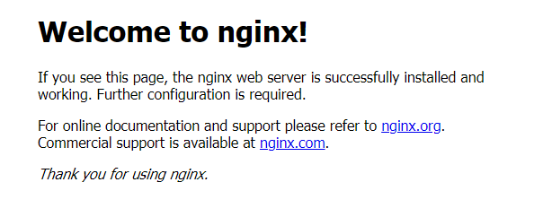
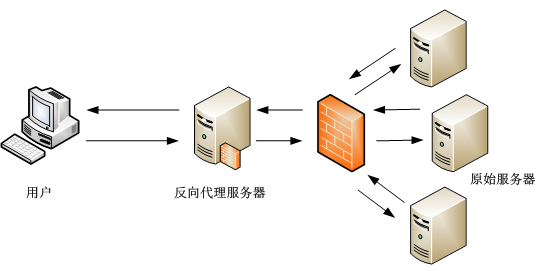

# 7.2 Nginx服务器

## 简介

Nginx是一款轻量级的Web 服务器/反向代理服务器及电子邮件（IMAP/POP3）代理服务器，在BSD-like 协议下发行。其特点是占有内存少，并发能力强，事实上nginx的并发能力在同类型的网页服务器中表现较好，中国大陆使用nginx网站用户有：百度、京东、新浪、网易、腾讯、淘宝等。

Nginx作为负载均衡服务：Nginx 既可以在内部直接支持 Rails 和 PHP 程序对外进行服务，也可以支持作为 HTTP代理服务对外进行服务。Nginx采用C进行编写，不论是系统资源开销还是CPU使用效率都比 Perlbal 要好很多。

## 安装

Nginx可以用过各linux发行版的包管理器安装，也可以自行编译安装或使用docker。ubuntu下使用apt安装：

> sudo apt install nginx

编译安装请参考[此处](http://www.nginx.cn/install)

## 第一个http服务

安装完成后，启动nginx服务：
> sudo service nginx start

打开浏览器，输入[http://127.0.0.1](http://127.0.0.1)，即可看到默认的nginx页面：



**php 站点**

- 如果需要运行一个php站点，则还需要增加如下配置：

```nginx
index index.php
```

## 配置文件

nginx的配置文件结构与apache类似：

```
/etc/nginx/
|-- nginx.conf
|-- mods-enabled
|       |-- *.load
|       `-- *.conf
|-- sites-enabled
|       `-- *.conf
```

- nginx将配置分散到各个不同的配置文件中，其中nginx.conf是主配置文件，将各个文件汇总在一起，常规建站请不要修改该配置文件。

- 在`mods-enabled/` 和 `sites-enabled/` 目录中的配置文件包含了已经启用的管理模块(module)、虚拟主机（sites）等配置。

    这些配置文件使用软链接创建来自 *-available中的配置文件，模块(mods)、站点(sites)的启用和禁用通过 `ln -s` 或 `rm` 命令来创建和删除对应配置的软连接文件 。

**注意：**
- 更改任何一个配置文件后需要重新启动apache服务以使其生效：

    > sudo service nginx restart

- 推荐在修改任何配置文件前先将原配置备份：
    
    > sudo cp * *.bak

- nginx 使用www-data用户访问文件和目录

## 配置https主机

首先需要获得一个ssl证书，证书的获取参考[此处](07_5_获得ssl证书.md)。得到证书后上传到服务器中一个安全的目录中存放，例如`/var/www/nginx`，推荐禁止www-data对证书目录和文件的**写**权限。

### 域名绑定

由于ssl证书是和域名绑定在一起的，在一个主机上运行多个域名的站点时就需要为不同的站点分别绑定域名，但即便是在运行单个域名的网站中我们也推荐绑定好域名，在对应的虚拟主机的配置文件下增加：

```nginx
server{
    server_name Your_domain_Name;
}
```

### 使用ssl证书

默认站点配置文件在`/etc/nginx/sites-available/default.conf`中，配置ssl证书路径：

```nginx
ssl_certificate /var/www/nginx/site.pem;
ssl_certificate_key /var/www/nginx/site.key;
```

然后增加下列配置：

```nginx
ssl_session_timeout 5m;
keepalive_timeout 60;
ssl_protocols TLSv1 TLSv1.1 TLSv1.2;
ssl_ciphers ALL:!ADH:!EXPORT56:RC4+RSA:+HIGH:+MEDIUM:+LOW:+SSLv2:+EXP;
ssl_prefer_server_ciphers on;

# Add headers to serve security related headers
#Before enabling Strict-Transport-Security headers please read into this topic first.
#WARNING: Only add the preload option once you read about the consequences in https://hstspreload.org/. 
#This option will add the domain to a hardcoded list that is shipped in all major browsers and getting removed from this list could take several months.
add_header Strict-Transport-Security "max-age=15552000; includeSubDomains; preload" always;

add_header Referrer-Policy "no-referrer" always;
add_header X-Content-Type-Options "nosniff" always;
add_header X-Download-Options "noopen" always;
add_header X-Frame-Options "SAMEORIGIN" always;
add_header X-Permitted-Cross-Domain-Policies "none" always;
add_header X-Robots-Tag "none" always;
add_header X-XSS-Protection "1; mode=block" always;
```

保存退出后，需重启nginx服务使配置生效。

###  强制https访问

虽然我们使用了ssl证书对连接进行加密，但是用户仍然可以使用http协议访问到站点，有些比较懒的用户直接输入域名也会默认使用http协议，因此我们需要将所有的http请求转移到443端口使用https：

在对应的服务器虚拟主机的配置文件中修改配置：

```nginx
server {
        listen 80;
        listen [::]:80;
        server_name Your_Domain_Name;
        return 301 https://$server_name$request_uri;
}
```

保存退出后，需重启nginx服务使配置生效。

## 反向代理

反向代理（Reverse Proxy）方式是指以代理服务器来接受Internet上的连接请求，然后将请求转发给内部网络上的服务器，并将从服务器上得到的结果返回给Internet上请求连接的客户端，此时代理服务器对外就表现为一个服务器。



nginx 配置反向代理非常简单，在对应的服务器配置文件里添加如下配置即可:

```nginx
location / {
        proxy_pass http://127.0.0.1:8080;
}
```

以上代码段将本站根目录的请求全部转至本机的8080端口